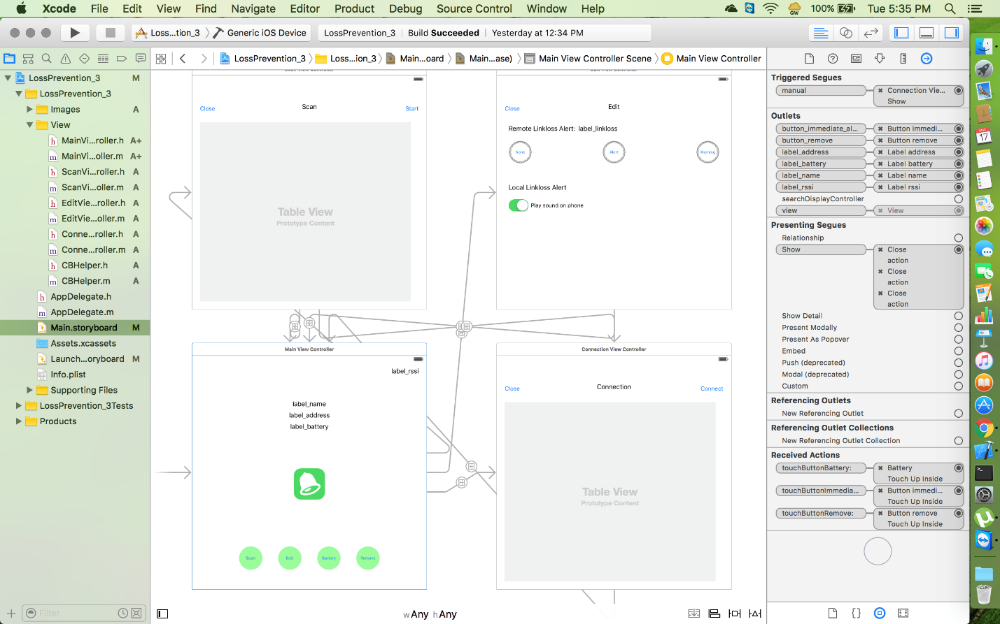
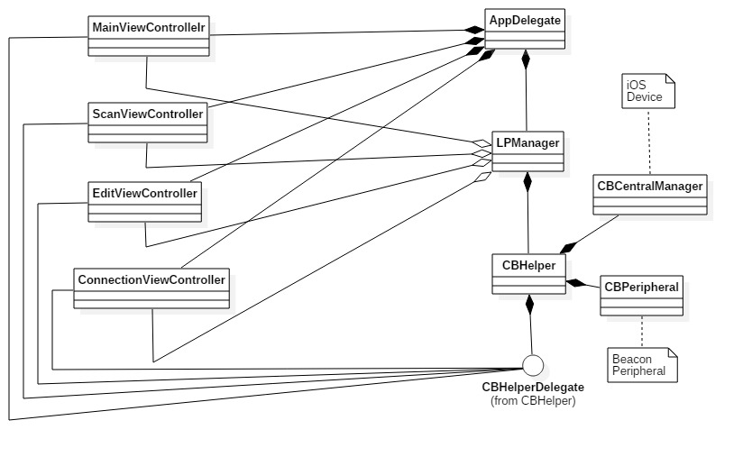
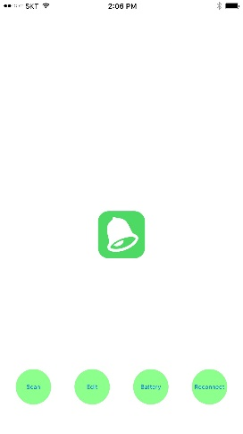
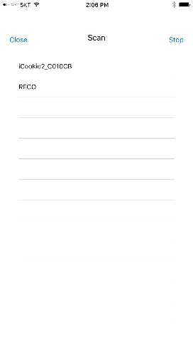
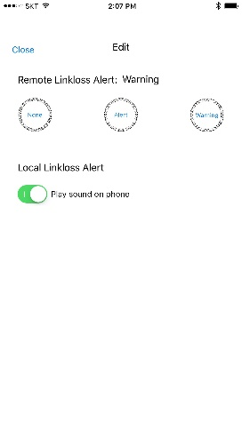

# iOSAppBeacon

iOS application for communication and control with beacon (Bluetooth) devices.

Xcode development tool and [CoreBluetooth](https://developer.apple.com/library/archive/documentation/NetworkingInternetWeb/Conceptual/CoreBluetooth_concepts/CoreBluetoothOverview/CoreBluetoothOverview.html#//apple_ref/doc/uid/TP40013257-CH2-SW1) library were used.

#####AppDelegate  
This class receives callbacks for the execution and termination of an app, entering the background state, or reactivating.

#####CBCentralManager  
This class is responsible for `central` function in CoreBluetooth.

#####CBPeripheral  
This class is in charge of `peripheral` functions in CoreBluetooth.

#####LPManager  
`CBHelper` in charge of interaction with beacons and a class that manages interactions between various views. The `LPManager` is assigned with app execution and is shared among all views until the app is closed.

#####CBHelper  
It includes `CBCentralManager` and `CBPeripheral` in charge of CoreBluetooth function, and receives their callbacks.

#####CBHelperDelegate  
When `CBHelper` receives a callback delivered from a `CBCentralManager`, that is, a device that performs a central function, or a `CBPeripheral`, that is, a beacon device, it generates an event of `CBHelperDelegate` so that each view controller can perform processing logic according to the event.

#####MainViewController  
Handles the app's main screen.

#####ScanViewController  
Scan the beacon and make the connection.

#####EditViewController  
Set the alarm sound of the connected beacon or `central` device.

#####ConnectionViewController  
Displays the information of the connected beacon device.

